# Análise de Teste A/B — Otimização de Conversão de E-commerce (Abacus AI)

## 📌 Visão Geral

Este projeto apresenta uma análise completa de um **teste A/B de ponta a ponta** para um experimento de página de produto de e-commerce, utilizando **Abacus AI + Python**.

O objetivo foi determinar se uma **nova página de produto (grupo de tratamento)** melhora a taxa de conversão em comparação com a **página atual (grupo de controle)** — e traduzir esses resultados em **impacto financeiro real**.

---

## 🎯 Objetivo

Avaliar se a nova página aumenta as conversões:

- **H₀ (Hipótese Nula):** Conversão_controle = Conversão_tratamento
- **H₁ (Hipótese Alternativa):** Conversão_controle ≠ Conversão_tratamento

Limite de decisão:
- **α = 0,05 (nível de significância de 5%)**

---

## Dataset

- ~290.000 usuários
- Atributos principais: `user_id`, `timestamp`, `group`, `landing_page`, `converted`, `country`.

---

## Validação e Limpeza de Dados

Principais verificações realizadas para garantir a integridade dos dados:

- ✅ Sem valores ausentes (missing values)
- ✅ Usuários duplicados removidos (mantendo apenas a primeira entrada)
- ✅ Nenhum usuário atribuído a ambos os grupos simultaneamente
- ✅ Verificação da consistência entre grupo e página exibida

📷 *(aqui uma imagem do Step 3 — verificação de valores nulos)*

  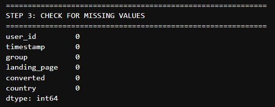

📷 *(aqui uma imagem do Step 4 — contagem de usuários duplicados)*

  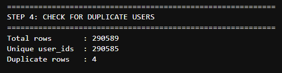

📷 *(aqui uma imagem do Step 5 — detalhe dos usuários duplicados)*

  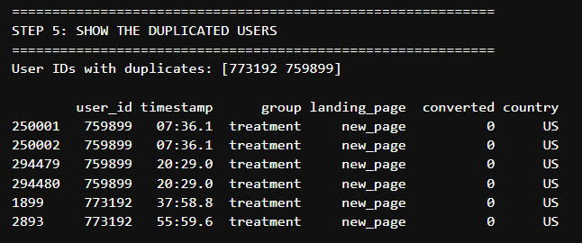

📷 *(aqui uma imagem do Step 6 — linhas antes e depois da limpeza)*

  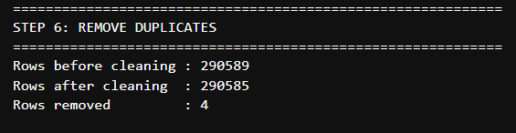

📷 *(aqui uma imagem do Step 7 — confirmação de usuários em grupo único)*

  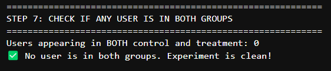

---

## Verificação de Randomização

Verificamos se o tráfego foi dividido corretamente para evitar viés:

- Controle: **145.274 usuários**
- Tratamento: **145.311 usuários**
- Divisão: **~50/50**

📷 *(aqui uma imagem do Step 8 — tamanhos dos grupos)*

  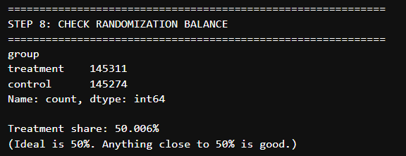

📷 *(aqui uma imagem do Step 9 — teste-z para balanceamento)*

  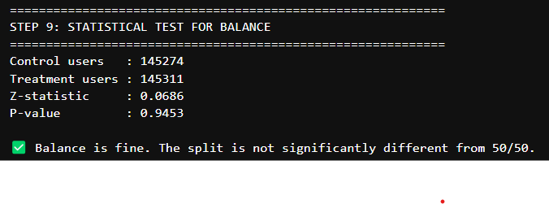

---

## Análise de Conversão

### Taxa de Conversão Geral
- Controle: **12,0386%**
- Tratamento: **11,8807%**

📷 *(aqui uma imagem do Step 10 — tabela de taxa de conversão)*

  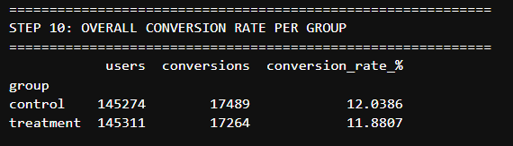

📷 *(aqui uma imagem do Step 28 — Gráfico 1: gráfico de barras de conversão geral)*

  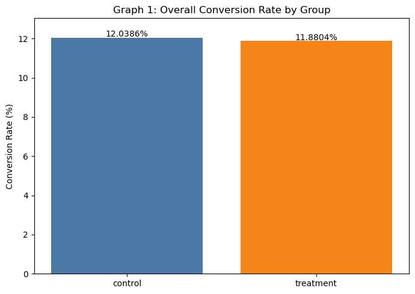

### Lift (Impacto)
- Lift Absoluto: **-0,1579 pp** (pontos percentuais)
- Lift Relativo: **-1,31%**

📷 *(aqui uma imagem do Step 11 — cálculo de lift)*

  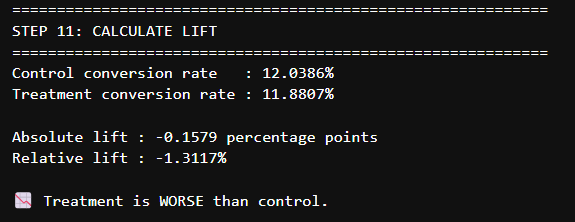

---

## Teste Estatístico (Significância)

Realizamos o Teste-Z para duas proporções:

- **Z-statistic:** -1,3116
- **p-valor:** 0,1896

📌 Como o **p-valor > 0,05**, o resultado **não tem significância estatística**. Falhamos em rejeitar a hipótese nula.

📷 *(aqui uma imagem do Step 12 — resultado do teste-z)*

  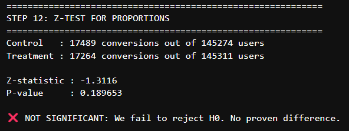

---

## Intervalo de Confiança (95%)

- **IC de 95%:** [-0,3939 pp, +0,0781 pp]

📌 O intervalo cruza o zero, confirmando que não há evidências de que o tratamento seja melhor ou pior.

📷 *(aqui uma imagem do Step 13 — intervalo de confiança)*

  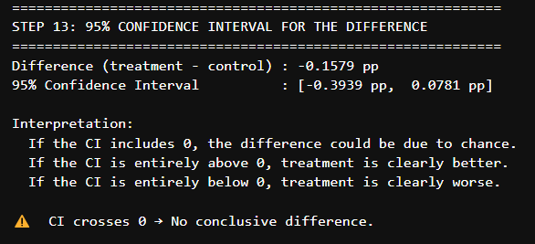

---

## Impacto no Negócio (Em Escala)

Cenário estimado com Ticket Médio (AOV) de $75:

| Usuários | Conversões Incrementais | Impacto na Receita |
| :--- | :--- | :--- |
| 100.000 | -157,9 | -$11.843 |
| 1.000.000 | -1.579,1 | -$118.429 |

📷 *(aqui uma imagem do Step 14 — impacto de negócio)*

  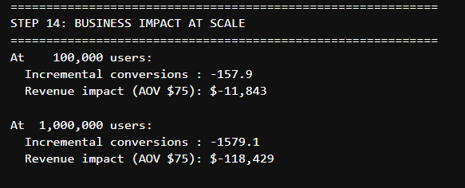

---

## Segmentação por País

| País | Controle | Tratamento | Lift |
| :--- | :--- | :--- | :--- |
| UK (Reino Unido) | 12,00% | 12,12% | ✅ +0,11 pp |
| US (EUA) | 12,06% | 11,85% | ❌ -0,22 pp |
| CA (Canadá) | 11,88% | 11,19% | ❌ -0,69 pp |

📷 *(aqui uma imagem do Step 15 — tabela de conversão por país)*

  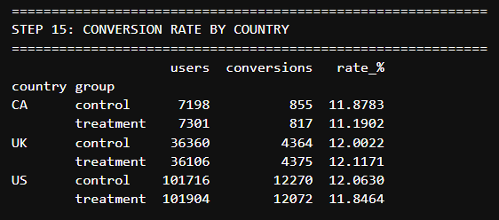

📷 *(aqui uma imagem do Step 16 — teste-z por país)*

  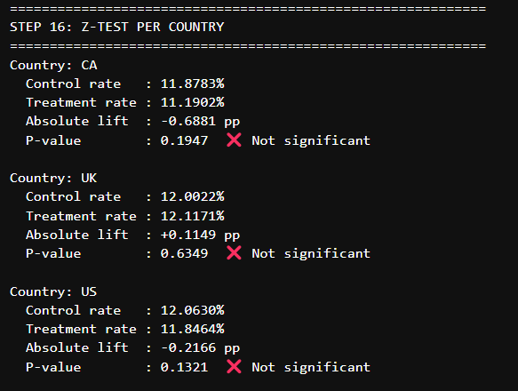

📷 *(aqui uma imagem do Step 30 — Gráfico 3: conversão por país e grupo)*

  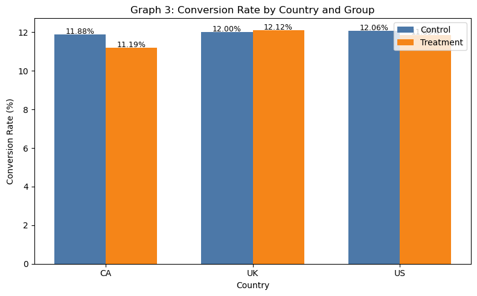

---

## Análise Temporal

### Conversão ao Longo do Tempo
📷 *(aqui uma imagem do Step 18 — tabela de buckets de minutos)*

  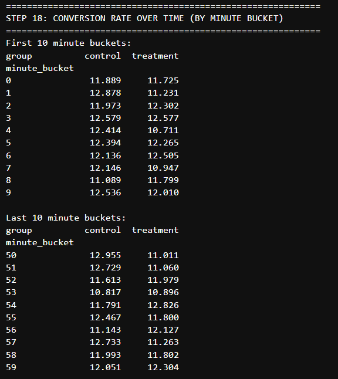

📷 *(aqui uma imagem do Step 29 — Gráfico 2: taxa de conversão temporal)*

  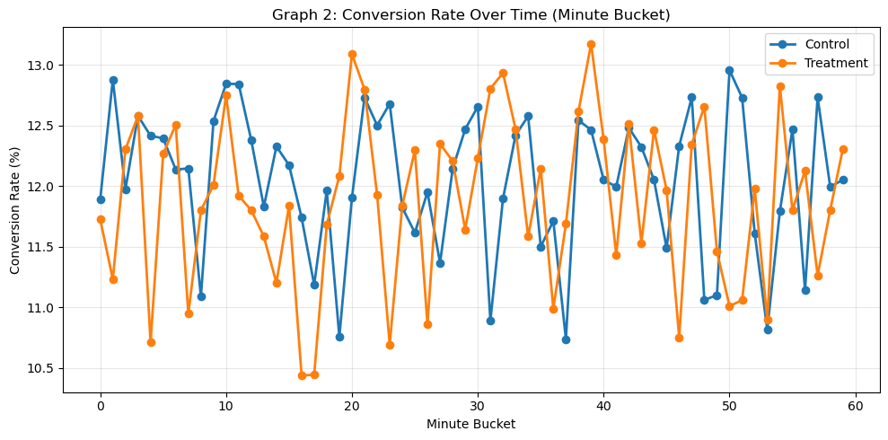

### Persistência de Efeito (Início vs Fim do Teste)
Verificamos se houve efeito de novidade comparando o início e o fim da amostragem.

📷 *(aqui uma imagem do Step 19 — tabela de early vs late)*

  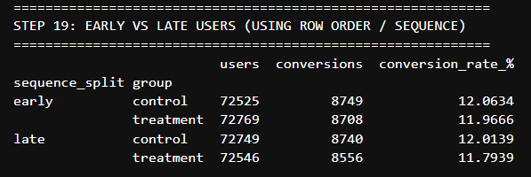

📷 *(aqui uma imagem do Step 21 — early vs late por tempo)*

  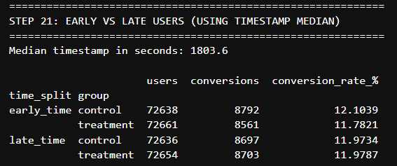

---

## Regressão Logística e Interações

Modelo avançado para detectar se o tratamento funciona melhor em algum país específico.

📷 *(aqui uma imagem do Step 24 — ranking de lift por país)*

  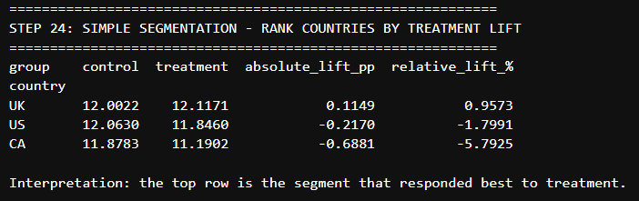

📷 *(aqui uma imagem do Step 26 — output da regressão logística)*

  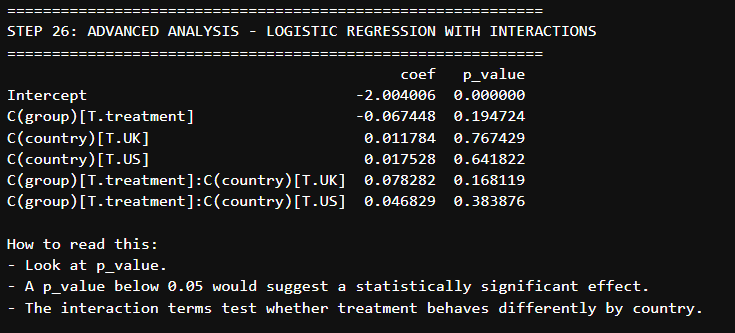

---

## Recomendação Final

📷 *(aqui uma imagem do Step 27 — bloco de decisão final)*

  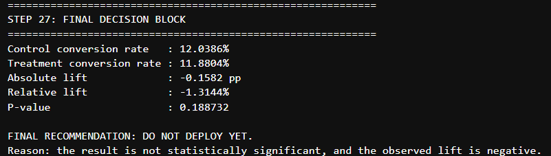

🚫 **NÃO IMPLEMENTAR a nova página.**

O tratamento apresentou uma performance direcionalmente inferior e não atingiu significância estatística. Manter a versão atual evita perdas financeiras e queda na taxa de conversão.

---

## 🛠️ Ferramentas Utilizadas

- **Linguagem:** Python
- **Bibliotecas:** Pandas, NumPy, SciPy, StatsModels, Matplotlib
- **Plataforma:** Abacus AI

---
